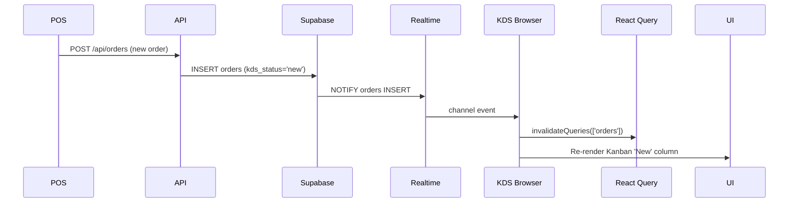

# Design Document: Vador OS — Production-Ready Restaurant Operating System

## Overview

Vador OS is a multi-tenant Restaurant Operating System built on Next.js 15 (App Router), Supabase, Zustand, React Query, Recharts, Framer Motion, and TypeScript. The existing codebase provides a solid foundation: an `AppShell` layout with `Sidebar` and `Navbar`, a Dashboard with metric cards and charts, a customer-facing menu with cart and order tracking, API routes for orders/inventory/notifications/audit, multi-tenant row-level security, and a Zustand store.

The goal of this design is to extend that foundation into a production-grade platform covering POS, KDS, Menu Management, Inventory, Staff, Customers, Reservations, Online Ordering, Analytics, AI Insights, Notifications, Global Search, Settings, and Multi-location — **without rewriting working code**. All additions follow the existing architectural patterns.

### Key Design Principles

- **Preserve first**: Existing components, store slices, API routes, and CSS tokens are kept and enhanced.
- **Feature-based organisation**: New code lives in `src/features/{feature}/` to avoid polluting the root.
- **Consistent API contract**: All routes use `{ data, error, meta }` envelope via a shared utility.
- **Type-safe end-to-end**: All new tables are typed in `database.types.ts`; Zod schemas cover every payload.
- **Real-time by default**: Supabase Realtime subscriptions power KDS, notifications, and order tracking.
- **Offline-resilient POS**: IndexedDB queue ensures no orders are lost on connectivity loss.

---

## Architecture

### Folder Structure

The project adopts a **feature-based** layout. Existing code under `src/components/`, `src/lib/`, `src/store/`, `src/data/`, and `src/app/` is preserved. New functionality is added under `src/features/`.

```
src/
├── app/                         # Next.js App Router pages (existing + new)
│   ├── (app)/                   # Authenticated shell group
│   │   ├── dashboard/           # ✅ existing
│   │   ├── pos/                 # ✅ existing → enhanced
│   │   ├── kitchen/             # ✅ existing → enhanced (KDS)
│   │   ├── menu/                # ✅ existing → public menu; new /menu/manage
│   │   ├── inventory/           # ✅ existing → enhanced
│   │   ├── staff/               # ✅ existing → enhanced
│   │   ├── analytics/           # ✅ existing → enhanced
│   │   ├── customers/           # 🆕
│   │   ├── reservations/        # 🆕
│   │   ├── settings/            # 🆕
│   │   └── search/              # 🆕
│   ├── api/                     # Route handlers (existing + new)
│   │   ├── orders/              # ✅ existing
│   │   ├── inventory/           # ✅ existing
│   │   ├── notifications/       # ✅ existing
│   │   ├── audit/               # ✅ existing
│   │   ├── health/              # ✅ existing
│   │   ├── menu/                # 🆕
│   │   ├── customers/           # 🆕
│   │   ├── reservations/        # 🆕
│   │   ├── staff/               # 🆕
│   │   ├── analytics/           # 🆕
│   │   ├── search/              # 🆕
│   │   └── settings/            # 🆕
│   └── [tenant]/order-tracking/ # 🆕 public order tracking
├── components/                  # ✅ existing shared components
│   └── ui/                      # 🆕 Radix-free headless primitives
├── features/                    # 🆕 feature modules
│   ├── pos/
│   ├── kds/
│   ├── menu-management/
│   ├── inventory/
│   ├── staff/
│   ├── customers/
│   ├── reservations/
│   ├── analytics/
│   ├── ai-insights/
│   ├── notifications/
│   ├── search/
│   ├── settings/
│   └── locations/
├── lib/                         # ✅ existing utilities + new
│   ├── api.ts                   # ✅ existing → extended
│   ├── auth.ts                  # ✅ existing → extended (RBAC)
│   ├── database.types.ts        # ✅ existing → extended
│   ├── validators.ts            # ✅ existing → extended
│   ├── response.ts              # 🆕 { data, error, meta } factory
│   ├── realtime.ts              # 🆕 Supabase channel helpers
│   ├── offline-queue.ts         # 🆕 IndexedDB queue for POS
│   └── ai.ts                    # 🆕 AI insights computation
├── store/
│   └── useStore.ts              # ✅ existing → extended with new slices
└── data/
    └── mockData.ts              # ✅ existing
```

### Data Flow Architecture

```mermaid
flowchart TD
    Browser["Browser / Client"]
    MW["Next.js Middleware\n(tenant_slug resolution, RBAC)"]
    API["API Route Handlers\n(/app/api/**)"]
    SB["Supabase\n(Postgres + Auth + Realtime + Storage)"]
    ZS["Zustand Store\n(UI + ephemeral state)"]
    RQ["React Query\n(server state cache)"]
    RT["Supabase Realtime\n(WebSocket channels)"]
    IDB["IndexedDB\n(offline POS queue)"]

    Browser -->|HTTP requests| MW
    MW --> API
    API -->|Postgres queries| SB
    SB -->|RLS filtered rows| API
    API -->|{ data, error, meta }| Browser
    Browser -->|useQuery / useMutation| RQ
    RQ --> API
    Browser -->|Zustand dispatch| ZS
    ZS -->|derived state| Browser
    SB -->|INSERT/UPDATE events| RT
    RT -->|channel subscription| Browser
    Browser <-->|offline orders| IDB
```

### Request Lifecycle

1. Browser triggers a data fetch via React Query `useQuery`.
2. Next.js Middleware resolves `tenant_slug` from host and sets `x-tenant-slug` header.
3. API route handler calls `requireAuth()` then `requireRole(roles)`.
4. Handler queries Supabase with Zod-validated payload; RLS enforces tenant isolation.
5. Response is wrapped in `apiResponse({ data, error, meta })` and returned.
6. React Query caches the result; stale-while-revalidate keeps UI fresh.
7. Supabase Realtime pushes mutations; React Query cache is invalidated via `queryClient.invalidateQueries`.

---

## Components and Interfaces

### Design System Tokens (extension of existing `globals.css`)

The existing `globals.css` already defines the core token set. The following additions complete the full semantic palette and typography scale.

**Additional CSS custom properties to add to `:root` / `.dark`:**

```css
/* Typography scale */
--font-sans: 'Inter', ui-sans-serif, system-ui, sans-serif;
--font-mono: 'JetBrains Mono', ui-monospace, monospace;

--text-xs:   0.75rem;   /* 12px – captions, badges */
--text-sm:   0.875rem;  /* 14px – labels, table cells */
--text-base: 1rem;      /* 16px – body */
--text-lg:   1.125rem;  /* 18px – section titles */
--text-xl:   1.25rem;   /* 20px – card headings */
--text-2xl:  1.5rem;    /* 24px – page headings */
--text-3xl:  1.875rem;  /* 30px – hero numbers */
--text-4xl:  2.25rem;   /* 36px – dashboard KPIs */

--font-normal:    400;
--font-medium:    500;
--font-semibold:  600;
--font-bold:      700;
--font-black:     900;

--leading-tight:  1.25;
--leading-snug:   1.375;
--leading-normal: 1.5;
--leading-relaxed:1.625;

/* Extended semantic colors (light) */
--success:             #10B981;
--success-foreground:  #ffffff;
--warning:             #F59E0B;
--warning-foreground:  #ffffff;
--info:                #3B82F6;
--info-foreground:     #ffffff;
--gold:                #C5A880;
--gold-muted:          #DFA95A;
--orange-accent:       #F97316;

/* Spacing / layout */
--sidebar-width-open:    280px;
--sidebar-width-closed:  76px;
--navbar-height:         64px;
--content-max-width:     1440px;
```

**New utility classes to add to `globals.css`:**

```css
/* Loading shimmer animation */
@keyframes shimmer {
  0%   { background-position: -200% 0; }
  100% { background-position:  200% 0; }
}
.skeleton {
  background: linear-gradient(90deg,
    var(--muted) 25%, rgba(255,255,255,0.1) 50%, var(--muted) 75%);
  background-size: 200% 100%;
  animation: shimmer 1.5s infinite;
  border-radius: var(--radius);
}

/* Count-up value transition */
.metric-value {
  transition: all 0.6s cubic-bezier(0.16, 1, 0.3, 1);
}

/* Focus ring conforming to WCAG AA */
.focus-ring:focus-visible {
  outline: 2px solid var(--ring);
  outline-offset: 3px;
}
```

### Shared UI Primitives (`src/components/ui/`)

These are headless, accessible primitives that wrap raw HTML/ARIA, styled with Tailwind. They do **not** require Radix UI, keeping the bundle lean.

| Component | Description |
|-----------|-------------|
| `Button` | Variants: primary, secondary, ghost, destructive. Sizes: sm, md, lg. Full keyboard + ARIA. |
| `Input` | Controlled input with label, error, helper text, icon slot. |
| `Select` | Accessible select/combobox with search. |
| `Modal` | Focus-trapped dialog with spring animation. `aria-modal`, `role="dialog"`. |
| `Drawer` | Side panel with spring open/close. Focus trap + restore. |
| `Sheet` | Full-height side sheet variant of Drawer. |
| `Tabs` | `role="tablist"` / `role="tab"` / `role="tabpanel"` with keyboard nav. |
| `Badge` | Color variants matching semantic tokens. |
| `Skeleton` | Shimmer block with configurable dimensions. |
| `EmptyState` | Icon + heading + body + CTA slot. |
| `ErrorBoundary` | React class error boundary with fallback UI. |
| `Toast` | Programmatic toast notification (success/error/warning/info). |
| `Tooltip` | `role="tooltip"` hover/focus tooltip. |
| `DropdownMenu` | Accessible menu with keyboard navigation. |
| `DataTable` | Virtualised table with sortable columns, pagination, row selection. |
| `DatePicker` | Calendar input with range support. |
| `FileUpload` | Drag-and-drop file input with preview and progress. |
| `CommandPalette` | Cmd+K global search overlay. |
| `Kanban` | Column + card container wrapping `@dnd-kit/core`. |
| `Avatar` | User avatar with fallback initials. |
| `Pagination` | Page/pageSize controls wired to URL params. |

### Feature Module Structure

Each feature under `src/features/{feature}/` follows this internal structure:

```
src/features/pos/
├── components/          # Feature-specific UI components
│   ├── POSLayout.tsx
│   ├── ProductGrid.tsx
│   ├── OrderCart.tsx
│   └── PaymentModal.tsx
├── hooks/               # React Query hooks for this feature
│   ├── useMenuItems.ts
│   └── usePOSOrder.ts
├── store/               # Zustand slice (imported in root useStore.ts)
│   └── posSlice.ts
├── utils/               # Pure helper functions (tax, discount, receipt)
│   ├── taxCalculator.ts
│   ├── discountEngine.ts
│   └── receiptFormatter.ts
├── types.ts             # Feature-specific TypeScript interfaces
└── index.ts             # Public exports
```

### Key Feature Component Hierarchies

#### POS Terminal

```
POSPage
└── AppShell
    └── POSLayout (two-panel grid)
        ├── [Left] ProductPanel
        │   ├── CategoryTabs
        │   ├── ProductGrid (virtual scroll)
        │   │   └── ProductCard (tap-to-add, barcode trigger)
        │   └── TableSelector
        └── [Right] OrderPanel
            ├── OrderCart
            │   └── CartItem (quantity stepper, item notes, item discount)
            ├── DiscountBar (order-level discount, coupon code)
            ├── TaxSummary
            ├── SplitBillModal
            └── PaymentModal
                └── PaymentMethodTabs (Cash | Card | Digital Wallet)
```

#### Kitchen Display System (KDS)

```
KitchenPage
└── KDSLayout (full-screen capable)
    ├── KDSToolbar (filters, search, full-screen toggle)
    └── KanbanBoard (dnd-kit DndContext)
        ├── KanbanColumn: New
        ├── KanbanColumn: Preparing
        ├── KanbanColumn: Ready
        └── KanbanColumn: Served
            └── OrderCard
                ├── OrderTimer (countdown with warning at threshold)
                ├── PriorityBadge
                ├── OrderItemList (with kitchen notes)
                └── AudioAlert (Web Audio API)
```

#### Menu Management

```
MenuManagePage
└── AppShell
    └── MenuManagerLayout
        ├── CategoryList (dnd-kit sortable, CRUD sidebar)
        └── ItemGrid (dnd-kit sortable within category)
            ├── MenuItemCard
            ├── MenuItemFormDrawer
            │   ├── BasicFields (name, description, price)
            │   ├── VariantBuilder (add size/modifier rows)
            │   ├── AvailabilityScheduler (day/time matrix)
            │   ├── NutritionalInfo
            │   └── ImageUploader → Supabase Storage
            └── BulkActionBar (select-all, price change, toggle)
```

#### Analytics Engine

```
AnalyticsPage
└── AppShell
    └── AnalyticsLayout
        ├── DateRangePicker
        ├── LocationSelector (multi-location roll-up toggle)
        ├── KPIRow (Revenue, Expenses, Gross Profit, Food Cost %)
        ├── SalesTrendChart (Recharts AreaChart)
        ├── PeakHourChart (Recharts BarChart)
        ├── TopItemsTable (DataTable with rank)
        ├── StaffPerformanceTable
        ├── InventoryValuationCard
        ├── CustomerRetentionCard
        └── ExportButton (CSV)
```

#### Notification Center

```
Navbar
└── NotificationBell (unread badge)
    └── NotificationPanel (Drawer)
        ├── MarkAllReadButton
        └── NotificationGroups
            └── NotificationGroup (by type)
                └── NotificationCard (read/unread state, critical style)
```

#### Global Search (Cmd+K)

```
CommandPalette (portal, Escape to close)
├── SearchInput (debounced 150ms)
└── ResultsList
    ├── ResultGroup: Orders
    ├── ResultGroup: Customers
    ├── ResultGroup: Inventory
    ├── ResultGroup: Products
    ├── ResultGroup: Employees
    ├── ResultGroup: Reservations
    └── ResultGroup: Reports
```

---

## State Management Strategy

### Zustand (Global / UI State)

The existing `useStore.ts` is preserved and extended with typed slices. Each feature exposes a `createXxxSlice` factory merged into the root store to avoid a monolithic file.

```typescript
// src/store/useStore.ts — extended shape (additive only)
interface AppState extends
  ExistingAppState,    // all existing fields preserved
  POSSlice,
  KDSSlice,
  NotificationSlice,
  LocationSlice,
  SearchSlice {}
```

**Zustand manages:**
- UI state: sidebar open/closed, theme, active workspace/location, notification panel
- Ephemeral POS state: current order draft, table selection, payment step
- KDS local state: filter, full-screen flag, audio alert preference
- Offline queue reference (delegates to `offline-queue.ts`)
- Global search query and result cache

### React Query (Server State)

React Query handles all data fetched from Supabase via Next.js API routes. Each feature defines custom hooks following a consistent pattern:

```typescript
// Pattern for a list query
export function useMenuItems(categoryId?: string) {
  return useQuery({
    queryKey: ['menu-items', categoryId],
    queryFn: () => apiFetch('/api/menu', { params: { categoryId } }),
    staleTime: 30_000,
    refetchInterval: 30_000,   // match dashboard 30s refresh requirement
  });
}

// Pattern for a mutation
export function useCreateOrder() {
  const qc = useQueryClient();
  return useMutation({
    mutationFn: createOrder,
    onSuccess: () => qc.invalidateQueries({ queryKey: ['orders'] }),
  });
}
```

**Cache key conventions:**
- `['orders', tenantSlug, locationId, filters]`
- `['menu-items', categoryId]`
- `['inventory', tenantSlug, locationId]`
- `['notifications', tenantSlug]`
- `['analytics', tenantSlug, locationId, dateRange]`

### Real-time State (Supabase Realtime + React Query)

```typescript
// src/lib/realtime.ts
export function subscribeToOrders(
  tenantSlug: string,
  onInsert: (order: OrderRow) => void
) {
  return supabase
    .channel(`orders:${tenantSlug}`)
    .on('postgres_changes', {
      event: 'INSERT',
      schema: 'public',
      table: 'orders',
      filter: `tenant_slug=eq.${tenantSlug}`
    }, payload => onInsert(payload.new as OrderRow))
    .subscribe();
}
```

Each real-time subscription is created in a `useEffect` with cleanup. On a relevant database event, the handler calls `queryClient.invalidateQueries` for the affected key, letting React Query re-fetch cleanly.

### Offline Queue (IndexedDB via `idb-keyval`)

```typescript
// src/lib/offline-queue.ts
export interface QueuedOrder { id: string; payload: CreateOrderPayload; createdAt: number; }

export async function enqueueOrder(payload: CreateOrderPayload): Promise<void>
export async function dequeueAll(): Promise<QueuedOrder[]>
export async function removeFromQueue(id: string): Promise<void>
```

The POS listens for `navigator.onLine` events. While offline, `createOrder` is intercepted and the payload is written to IndexedDB. When connectivity returns, a sync loop drains the queue and submits each order to `/api/orders`, then removes it from the queue.

---

## Data Models

### Extended Database Schema

All new tables extend the existing Supabase schema (`supabase.sql`). The existing `tenants`, `profiles`, `orders`, `order_items`, `inventory_items`, `notifications`, and `audit_logs` tables are unchanged.

#### New Enum Types

```sql
CREATE TYPE fulfillment_type  AS ENUM ('dine_in', 'takeaway', 'delivery');
CREATE TYPE payment_method    AS ENUM ('cash', 'card', 'digital_wallet');
CREATE TYPE priority_label    AS ENUM ('normal', 'urgent', 'vip');
CREATE TYPE kds_status        AS ENUM ('new', 'preparing', 'ready', 'served');
CREATE TYPE purchase_status   AS ENUM ('draft', 'ordered', 'received', 'cancelled');
CREATE TYPE shift_status      AS ENUM ('scheduled', 'active', 'completed', 'cancelled');
CREATE TYPE reservation_status AS ENUM ('pending', 'confirmed', 'seated', 'cancelled', 'no_show');
CREATE TYPE loyalty_tier      AS ENUM ('bronze', 'silver', 'gold', 'platinum');
CREATE TYPE coupon_type       AS ENUM ('percent', 'fixed');
CREATE TYPE transfer_status   AS ENUM ('pending', 'in_transit', 'completed', 'cancelled');
```

#### New Tables

```sql
-- Locations (physical branches)
CREATE TABLE locations (
  id           UUID PRIMARY KEY DEFAULT uuid_generate_v4(),
  tenant_slug  TEXT NOT NULL REFERENCES tenants(slug) ON DELETE CASCADE,
  name         TEXT NOT NULL,
  address      TEXT,
  phone        TEXT,
  email        TEXT,
  timezone     TEXT NOT NULL DEFAULT 'UTC',
  operating_hours JSONB,           -- { mon: {open: "08:00", close: "22:00"}, ... }
  is_active    BOOLEAN NOT NULL DEFAULT true,
  created_at   TIMESTAMPTZ NOT NULL DEFAULT now(),
  updated_at   TIMESTAMPTZ NOT NULL DEFAULT now(),
  deleted_at   TIMESTAMPTZ
);
CREATE INDEX locations_tenant_slug_idx ON locations(tenant_slug);

-- Menu Categories
CREATE TABLE menu_categories (
  id           UUID PRIMARY KEY DEFAULT uuid_generate_v4(),
  tenant_slug  TEXT NOT NULL REFERENCES tenants(slug) ON DELETE CASCADE,
  location_id  UUID REFERENCES locations(id),
  name         TEXT NOT NULL,
  description  TEXT,
  image_url    TEXT,
  sort_order   INTEGER NOT NULL DEFAULT 0,
  is_active    BOOLEAN NOT NULL DEFAULT true,
  created_at   TIMESTAMPTZ NOT NULL DEFAULT now(),
  updated_at   TIMESTAMPTZ NOT NULL DEFAULT now(),
  deleted_at   TIMESTAMPTZ
);
CREATE INDEX menu_categories_tenant_slug_idx ON menu_categories(tenant_slug);

-- Menu Items
CREATE TABLE menu_items (
  id              UUID PRIMARY KEY DEFAULT uuid_generate_v4(),
  tenant_slug     TEXT NOT NULL REFERENCES tenants(slug) ON DELETE CASCADE,
  category_id     UUID NOT NULL REFERENCES menu_categories(id) ON DELETE CASCADE,
  name            TEXT NOT NULL,
  description     TEXT,
  base_price      NUMERIC(12,2) NOT NULL CHECK (base_price >= 0),
  image_url       TEXT,
  tags            TEXT[],
  sku             TEXT,
  allergens       TEXT[],
  nutritional_info JSONB,
  is_active       BOOLEAN NOT NULL DEFAULT true,
  availability    JSONB,           -- { days: [1..7], from: "HH:MM", to: "HH:MM" }
  sort_order      INTEGER NOT NULL DEFAULT 0,
  created_at      TIMESTAMPTZ NOT NULL DEFAULT now(),
  updated_at      TIMESTAMPTZ NOT NULL DEFAULT now(),
  deleted_at      TIMESTAMPTZ
);
CREATE INDEX menu_items_tenant_slug_idx ON menu_items(tenant_slug);
CREATE INDEX menu_items_category_id_idx ON menu_items(category_id);
CREATE INDEX menu_items_is_active_idx   ON menu_items(is_active);

-- Menu Variants (e.g. size: Small, Medium, Large)
CREATE TABLE menu_variants (
  id           UUID PRIMARY KEY DEFAULT uuid_generate_v4(),
  tenant_slug  TEXT NOT NULL REFERENCES tenants(slug) ON DELETE CASCADE,
  menu_item_id UUID NOT NULL REFERENCES menu_items(id) ON DELETE CASCADE,
  name         TEXT NOT NULL,
  price_delta  NUMERIC(12,2) NOT NULL DEFAULT 0,
  is_default   BOOLEAN NOT NULL DEFAULT false,
  created_at   TIMESTAMPTZ NOT NULL DEFAULT now(),
  updated_at   TIMESTAMPTZ NOT NULL DEFAULT now(),
  deleted_at   TIMESTAMPTZ
);
CREATE INDEX menu_variants_menu_item_id_idx ON menu_variants(menu_item_id);

-- Menu Modifiers (e.g. extra shot, oat milk)
CREATE TABLE menu_modifiers (
  id           UUID PRIMARY KEY DEFAULT uuid_generate_v4(),
  tenant_slug  TEXT NOT NULL REFERENCES tenants(slug) ON DELETE CASCADE,
  menu_item_id UUID NOT NULL REFERENCES menu_items(id) ON DELETE CASCADE,
  name         TEXT NOT NULL,
  price_delta  NUMERIC(12,2) NOT NULL DEFAULT 0,
  created_at   TIMESTAMPTZ NOT NULL DEFAULT now(),
  updated_at   TIMESTAMPTZ NOT NULL DEFAULT now(),
  deleted_at   TIMESTAMPTZ
);
CREATE INDEX menu_modifiers_menu_item_id_idx ON menu_modifiers(menu_item_id);
```

```sql
-- Suppliers
CREATE TABLE suppliers (
  id           UUID PRIMARY KEY DEFAULT uuid_generate_v4(),
  tenant_slug  TEXT NOT NULL REFERENCES tenants(slug) ON DELETE CASCADE,
  name         TEXT NOT NULL,
  contact_name TEXT,
  email        TEXT,
  phone        TEXT,
  address      TEXT,
  notes        TEXT,
  created_at   TIMESTAMPTZ NOT NULL DEFAULT now(),
  updated_at   TIMESTAMPTZ NOT NULL DEFAULT now(),
  deleted_at   TIMESTAMPTZ
);
CREATE INDEX suppliers_tenant_slug_idx ON suppliers(tenant_slug);

-- Purchase Orders
CREATE TABLE purchase_orders (
  id                   UUID PRIMARY KEY DEFAULT uuid_generate_v4(),
  tenant_slug          TEXT NOT NULL REFERENCES tenants(slug) ON DELETE CASCADE,
  location_id          UUID REFERENCES locations(id),
  supplier_id          UUID NOT NULL REFERENCES suppliers(id),
  status               purchase_status NOT NULL DEFAULT 'draft',
  expected_delivery_at TIMESTAMPTZ,
  received_at          TIMESTAMPTZ,
  notes                TEXT,
  created_by           UUID,
  created_at           TIMESTAMPTZ NOT NULL DEFAULT now(),
  updated_at           TIMESTAMPTZ NOT NULL DEFAULT now(),
  deleted_at           TIMESTAMPTZ
);
CREATE INDEX purchase_orders_tenant_slug_idx ON purchase_orders(tenant_slug);
CREATE INDEX purchase_orders_status_idx      ON purchase_orders(status);

-- Purchase Order Items
CREATE TABLE purchase_order_items (
  id                UUID PRIMARY KEY DEFAULT uuid_generate_v4(),
  purchase_order_id UUID NOT NULL REFERENCES purchase_orders(id) ON DELETE CASCADE,
  inventory_item_id UUID NOT NULL REFERENCES inventory_items(id),
  quantity_ordered  NUMERIC(12,3) NOT NULL CHECK (quantity_ordered > 0),
  quantity_received NUMERIC(12,3),
  unit_cost         NUMERIC(12,2) NOT NULL CHECK (unit_cost >= 0),
  created_at        TIMESTAMPTZ NOT NULL DEFAULT now()
);
CREATE INDEX po_items_purchase_order_id_idx ON purchase_order_items(purchase_order_id);

-- Employees
CREATE TABLE employees (
  id            UUID PRIMARY KEY DEFAULT uuid_generate_v4(),
  tenant_slug   TEXT NOT NULL REFERENCES tenants(slug) ON DELETE CASCADE,
  location_id   UUID REFERENCES locations(id),
  profile_id    UUID REFERENCES profiles(id),
  full_name     TEXT NOT NULL,
  role          user_role NOT NULL DEFAULT 'waiter',
  email         TEXT,
  phone         TEXT,
  hire_date     DATE,
  hourly_rate   NUMERIC(10,2),
  is_active     BOOLEAN NOT NULL DEFAULT true,
  created_at    TIMESTAMPTZ NOT NULL DEFAULT now(),
  updated_at    TIMESTAMPTZ NOT NULL DEFAULT now(),
  deleted_at    TIMESTAMPTZ
);
CREATE INDEX employees_tenant_slug_idx  ON employees(tenant_slug);
CREATE INDEX employees_location_id_idx  ON employees(location_id);
CREATE INDEX employees_role_idx         ON employees(role);

-- Shifts
CREATE TABLE shifts (
  id           UUID PRIMARY KEY DEFAULT uuid_generate_v4(),
  tenant_slug  TEXT NOT NULL REFERENCES tenants(slug) ON DELETE CASCADE,
  employee_id  UUID NOT NULL REFERENCES employees(id),
  location_id  UUID REFERENCES locations(id),
  start_at     TIMESTAMPTZ NOT NULL,
  end_at       TIMESTAMPTZ NOT NULL,
  status       shift_status NOT NULL DEFAULT 'scheduled',
  notes        TEXT,
  created_at   TIMESTAMPTZ NOT NULL DEFAULT now(),
  updated_at   TIMESTAMPTZ NOT NULL DEFAULT now(),
  deleted_at   TIMESTAMPTZ,
  CHECK (end_at > start_at)
);
CREATE INDEX shifts_tenant_slug_idx  ON shifts(tenant_slug);
CREATE INDEX shifts_employee_id_idx  ON shifts(employee_id);
CREATE INDEX shifts_start_at_idx     ON shifts(start_at);

-- Attendance Logs
CREATE TABLE attendance_logs (
  id           UUID PRIMARY KEY DEFAULT uuid_generate_v4(),
  tenant_slug  TEXT NOT NULL REFERENCES tenants(slug) ON DELETE CASCADE,
  employee_id  UUID NOT NULL REFERENCES employees(id),
  shift_id     UUID REFERENCES shifts(id),
  clock_in_at  TIMESTAMPTZ NOT NULL,
  clock_out_at TIMESTAMPTZ,
  created_at   TIMESTAMPTZ NOT NULL DEFAULT now(),
  updated_at   TIMESTAMPTZ NOT NULL DEFAULT now()
);
CREATE INDEX attendance_logs_tenant_slug_idx  ON attendance_logs(tenant_slug);
CREATE INDEX attendance_logs_employee_id_idx  ON attendance_logs(employee_id);
CREATE INDEX attendance_logs_created_at_idx   ON attendance_logs(created_at DESC);
```

```sql
-- Customers
CREATE TABLE customers (
  id                  UUID PRIMARY KEY DEFAULT uuid_generate_v4(),
  tenant_slug         TEXT NOT NULL REFERENCES tenants(slug) ON DELETE CASCADE,
  full_name           TEXT NOT NULL,
  email               TEXT,
  phone               TEXT,
  birthday            DATE,
  notes               TEXT,
  marketing_opt_in    BOOLEAN NOT NULL DEFAULT false,
  loyalty_tier        loyalty_tier NOT NULL DEFAULT 'bronze',
  created_at          TIMESTAMPTZ NOT NULL DEFAULT now(),
  updated_at          TIMESTAMPTZ NOT NULL DEFAULT now(),
  deleted_at          TIMESTAMPTZ
);
CREATE INDEX customers_tenant_slug_idx ON customers(tenant_slug);
CREATE INDEX customers_created_at_idx  ON customers(created_at DESC);

-- Loyalty Points
CREATE TABLE loyalty_points (
  id           UUID PRIMARY KEY DEFAULT uuid_generate_v4(),
  tenant_slug  TEXT NOT NULL REFERENCES tenants(slug) ON DELETE CASCADE,
  customer_id  UUID NOT NULL REFERENCES customers(id) ON DELETE CASCADE,
  order_id     UUID REFERENCES orders(id),
  points_delta INTEGER NOT NULL,    -- positive = earned, negative = redeemed
  reason       TEXT NOT NULL,
  created_at   TIMESTAMPTZ NOT NULL DEFAULT now()
);
CREATE INDEX loyalty_points_customer_id_idx ON loyalty_points(customer_id);
CREATE INDEX loyalty_points_created_at_idx  ON loyalty_points(created_at DESC);

-- Coupons
CREATE TABLE coupons (
  id            UUID PRIMARY KEY DEFAULT uuid_generate_v4(),
  tenant_slug   TEXT NOT NULL REFERENCES tenants(slug) ON DELETE CASCADE,
  code          TEXT NOT NULL,
  type          coupon_type NOT NULL DEFAULT 'percent',
  value         NUMERIC(10,2) NOT NULL,
  usage_limit   INTEGER,
  usage_count   INTEGER NOT NULL DEFAULT 0,
  expires_at    TIMESTAMPTZ,
  is_active     BOOLEAN NOT NULL DEFAULT true,
  created_at    TIMESTAMPTZ NOT NULL DEFAULT now(),
  updated_at    TIMESTAMPTZ NOT NULL DEFAULT now(),
  deleted_at    TIMESTAMPTZ,
  UNIQUE (tenant_slug, code)
);

-- Reservations
CREATE TABLE reservations (
  id               UUID PRIMARY KEY DEFAULT uuid_generate_v4(),
  tenant_slug      TEXT NOT NULL REFERENCES tenants(slug) ON DELETE CASCADE,
  location_id      UUID REFERENCES locations(id),
  customer_id      UUID REFERENCES customers(id),
  guest_name       TEXT NOT NULL,
  guest_phone      TEXT,
  guest_email      TEXT,
  party_size       INTEGER NOT NULL CHECK (party_size > 0),
  table_id         TEXT,
  reserved_at      TIMESTAMPTZ NOT NULL,
  duration_minutes INTEGER NOT NULL DEFAULT 90,
  status           reservation_status NOT NULL DEFAULT 'pending',
  special_requests TEXT,
  created_at       TIMESTAMPTZ NOT NULL DEFAULT now(),
  updated_at       TIMESTAMPTZ NOT NULL DEFAULT now(),
  deleted_at       TIMESTAMPTZ
);
CREATE INDEX reservations_tenant_slug_idx  ON reservations(tenant_slug);
CREATE INDEX reservations_reserved_at_idx  ON reservations(reserved_at);
CREATE INDEX reservations_status_idx       ON reservations(status);
CREATE INDEX reservations_table_id_idx     ON reservations(table_id);

-- Waitlist Entries
CREATE TABLE waitlist_entries (
  id            UUID PRIMARY KEY DEFAULT uuid_generate_v4(),
  tenant_slug   TEXT NOT NULL REFERENCES tenants(slug) ON DELETE CASCADE,
  location_id   UUID REFERENCES locations(id),
  guest_name    TEXT NOT NULL,
  guest_phone   TEXT,
  party_size    INTEGER NOT NULL CHECK (party_size > 0),
  notes         TEXT,
  joined_at     TIMESTAMPTZ NOT NULL DEFAULT now(),
  seated_at     TIMESTAMPTZ,
  cancelled_at  TIMESTAMPTZ,
  created_at    TIMESTAMPTZ NOT NULL DEFAULT now(),
  updated_at    TIMESTAMPTZ NOT NULL DEFAULT now()
);
CREATE INDEX waitlist_entries_tenant_slug_idx ON waitlist_entries(tenant_slug);
CREATE INDEX waitlist_entries_joined_at_idx   ON waitlist_entries(joined_at);

-- Recipe Costing Rules (links menu_items to inventory ingredients)
CREATE TABLE recipe_items (
  id                UUID PRIMARY KEY DEFAULT uuid_generate_v4(),
  tenant_slug       TEXT NOT NULL REFERENCES tenants(slug) ON DELETE CASCADE,
  menu_item_id      UUID NOT NULL REFERENCES menu_items(id) ON DELETE CASCADE,
  inventory_item_id UUID NOT NULL REFERENCES inventory_items(id),
  quantity_used     NUMERIC(12,4) NOT NULL CHECK (quantity_used > 0),
  unit              TEXT NOT NULL,
  created_at        TIMESTAMPTZ NOT NULL DEFAULT now(),
  updated_at        TIMESTAMPTZ NOT NULL DEFAULT now()
);
CREATE INDEX recipe_items_menu_item_id_idx ON recipe_items(menu_item_id);

-- Inventory History (audit trail for all stock movements)
CREATE TABLE inventory_history (
  id                UUID PRIMARY KEY DEFAULT uuid_generate_v4(),
  tenant_slug       TEXT NOT NULL REFERENCES tenants(slug) ON DELETE CASCADE,
  inventory_item_id UUID NOT NULL REFERENCES inventory_items(id),
  quantity_before   NUMERIC(12,3) NOT NULL,
  quantity_after    NUMERIC(12,3) NOT NULL,
  reason            TEXT NOT NULL,
  reference_id      UUID,           -- order_id, purchase_order_id, or transfer_id
  performed_by      UUID,
  created_at        TIMESTAMPTZ NOT NULL DEFAULT now()
);
CREATE INDEX inventory_history_item_idx     ON inventory_history(inventory_item_id);
CREATE INDEX inventory_history_created_at_idx ON inventory_history(created_at DESC);
```

### Schema Extensions to Existing Tables

```sql
-- orders: add new columns (non-breaking additions)
ALTER TABLE orders
  ADD COLUMN location_id       UUID REFERENCES locations(id),
  ADD COLUMN fulfillment_type  fulfillment_type NOT NULL DEFAULT 'dine_in',
  ADD COLUMN payment_method    payment_method,
  ADD COLUMN kds_status        kds_status NOT NULL DEFAULT 'new',
  ADD COLUMN priority          priority_label NOT NULL DEFAULT 'normal',
  ADD COLUMN discount_amount   NUMERIC(12,2) DEFAULT 0,
  ADD COLUMN tax_amount        NUMERIC(12,2) DEFAULT 0,
  ADD COLUMN delivery_address  JSONB,
  ADD COLUMN updated_at        TIMESTAMPTZ DEFAULT now(),
  ADD COLUMN deleted_at        TIMESTAMPTZ;

CREATE INDEX orders_kds_status_idx    ON orders(kds_status);
CREATE INDEX orders_location_id_idx   ON orders(location_id);

-- inventory_items: add new columns
ALTER TABLE inventory_items
  ADD COLUMN location_id   UUID REFERENCES locations(id),
  ADD COLUMN supplier_id   UUID REFERENCES suppliers(id),
  ADD COLUMN cost_price    NUMERIC(12,2) DEFAULT 0,
  ADD COLUMN expiry_date   DATE,
  ADD COLUMN barcode       TEXT,
  ADD COLUMN created_at    TIMESTAMPTZ DEFAULT now(),
  ADD COLUMN deleted_at    TIMESTAMPTZ;

CREATE INDEX inventory_items_location_id_idx ON inventory_items(location_id);
```

### Row Level Security (RLS) Patterns for New Tables

All new tables follow the same RLS pattern as existing tables:

```sql
-- Pattern applied to every new table
ALTER TABLE {table_name} ENABLE ROW LEVEL SECURITY;

CREATE POLICY tenant_{table_name}_select ON {table_name}
  FOR SELECT USING (
    tenant_slug = current_setting('request.jwt.claims.tenant_slug', true)
  );

CREATE POLICY tenant_{table_name}_insert ON {table_name}
  FOR INSERT WITH CHECK (
    tenant_slug = current_setting('request.jwt.claims.tenant_slug', true)
  );

CREATE POLICY tenant_{table_name}_update ON {table_name}
  FOR UPDATE USING (
    tenant_slug = current_setting('request.jwt.claims.tenant_slug', true)
  );

-- Soft deletes: no hard DELETE policy; deleted_at IS SET instead
```

### TypeScript Type Extensions (`database.types.ts`)

The existing `Database` interface in `src/lib/database.types.ts` is extended with Row/Insert/Update types for all new tables, following the existing pattern exactly. New enum types are added to `Database['public']['Enums']`.

---

## API Layer

### Response Envelope (`src/lib/response.ts`)

All API routes use a shared factory to ensure the `{ data, error, meta }` contract:

```typescript
export interface ApiMeta {
  total?: number;
  page?: number;
  pageSize?: number;
  [key: string]: unknown;
}

export function apiResponse<T>(
  data: T | null,
  error: string | null = null,
  meta: ApiMeta = {},
  status = 200
): Response {
  return Response.json({ data, error, meta }, { status });
}

export function apiError(message: string, status: number): Response {
  return Response.json({ data: null, error: message, meta: {} }, { status });
}
```

### RBAC Middleware (`src/lib/auth.ts` extension)

```typescript
export type UserRole = 'admin' | 'manager' | 'cashier' | 'kitchen' | 'waiter' | 'customer';

const ROLE_HIERARCHY: Record<UserRole, number> = {
  admin: 6, manager: 5, cashier: 4, kitchen: 3, waiter: 2, customer: 1
};

export async function requireRole(minRole: UserRole) {
  const { supabase, session } = await requireAuth();
  const { data: profile } = await supabase
    .from('profiles')
    .select('role')
    .eq('user_id', session.user.id)
    .single();

  if (!profile || ROLE_HIERARCHY[profile.role as UserRole] < ROLE_HIERARCHY[minRole]) {
    throw apiError('Forbidden', 403);
  }
  return { supabase, session, profile };
}
```

### Pagination, Filtering, and Sorting Pattern

```typescript
// Utility applied by all list endpoints
export function parsePaginationParams(url: URL) {
  const page     = Math.max(1, parseInt(url.searchParams.get('page')     ?? '1'));
  const pageSize = Math.min(100, parseInt(url.searchParams.get('pageSize') ?? '20'));
  const sortBy   = url.searchParams.get('sortBy')  ?? 'created_at';
  const sortDir  = url.searchParams.get('sortDir') === 'asc' ? true : false; // ascending = true
  return { page, pageSize, from: (page - 1) * pageSize, to: page * pageSize - 1, sortBy, sortDir };
}
```

### Key API Route Contracts

| Route | Methods | Auth | Description |
|-------|---------|------|-------------|
| `/api/orders` | GET, POST | cashier+ | List/create orders |
| `/api/orders/[id]` | GET, PATCH | cashier+ | Get/update single order |
| `/api/orders/[id]/refund` | POST | manager+ | Process refund |
| `/api/menu/categories` | GET, POST, PATCH, DELETE | manager+ | Menu categories |
| `/api/menu/items` | GET, POST, PATCH, DELETE | manager+ | Menu items |
| `/api/inventory` | GET, POST, PATCH | manager+ | Inventory items |
| `/api/inventory/[id]/adjust` | POST | manager+ | Stock adjustment |
| `/api/inventory/transfers` | GET, POST | manager+ | Inter-location transfers |
| `/api/purchase-orders` | GET, POST, PATCH | manager+ | Purchase orders |
| `/api/staff/employees` | GET, POST, PATCH | manager+ | Employee records |
| `/api/staff/shifts` | GET, POST, PATCH | manager+ | Shift schedules |
| `/api/staff/attendance` | GET, POST | cashier+ | Clock in/out |
| `/api/customers` | GET, POST, PATCH | cashier+ | Customer profiles |
| `/api/customers/[id]/loyalty` | GET, POST | cashier+ | Loyalty points |
| `/api/reservations` | GET, POST, PATCH | waiter+ | Reservations |
| `/api/waitlist` | GET, POST, PATCH | waiter+ | Waitlist entries |
| `/api/analytics` | GET | manager+ | Aggregated metrics |
| `/api/search` | GET | waiter+ | Global search |
| `/api/settings` | GET, PATCH | admin | Tenant settings |
| `/api/locations` | GET, POST, PATCH | admin | Location management |
| `/api/notifications` | GET, PATCH | all | Notification list/read |
| `/api/audit` | GET | manager+ | Audit log |
| `/api/health` | GET | none | Health check |

---

## Authentication Flow

### Auth Providers

Supabase Auth handles all three flows via the existing `createRouteHandlerClient`:

1. **Email/Password** — standard `supabase.auth.signInWithPassword()`
2. **Google OAuth** — `supabase.auth.signInWithOAuth({ provider: 'google' })`
3. **Magic Link** — `supabase.auth.signInWithOtp({ email })`

After any successful sign-in, a Supabase Auth trigger upserts a row in `profiles` with the `tenant_slug` derived from the subdomain and the default role.

### 2FA (TOTP)

For `admin` and `manager` roles, TOTP 2FA is enforced via Supabase's MFA API:
- `supabase.auth.mfa.enroll({ factorType: 'totp' })` — returns QR code for authenticator app setup
- `supabase.auth.mfa.challenge()` + `supabase.auth.mfa.verify()` — validates OTP code on login
- Middleware checks `session.user.factors` to confirm MFA was satisfied before granting admin/manager access

### Session Management

Sessions use Supabase's `@supabase/auth-helpers-nextjs` cookie-based approach (HttpOnly, SameSite=Strict). The existing `middleware.ts` is extended to:
1. Refresh the session on each request
2. Resolve `tenant_slug` from hostname
3. Return 401 for unauthenticated requests to protected routes

```typescript
// middleware.ts — extended
export async function middleware(request: NextRequest) {
  const response = NextResponse.next();
  const supabase = createMiddlewareClient({ req: request, res: response });
  const { data: { session } } = await supabase.auth.getSession();

  const tenantSlug = getTenantIdFromHost(request.headers.get('host') ?? undefined);
  response.headers.set('x-tenant-slug', tenantSlug);

  const isProtected = request.nextUrl.pathname.startsWith('/dashboard') ||
                      request.nextUrl.pathname.startsWith('/api/') && 
                      !request.nextUrl.pathname.startsWith('/api/health');

  if (isProtected && !session) {
    return NextResponse.redirect(new URL('/login', request.url));
  }
  return response;
}
```

### CSRF Protection

All state-changing API routes (POST, PATCH, DELETE) validate a `X-Requested-With: XMLHttpRequest` header (simple CSRF mitigation) or a double-submit CSRF token pattern for forms that cannot set custom headers.

### Audit Logging

Auth events are logged via a Supabase Auth webhook or by inserting directly in the route handler:

```typescript
await supabase.from('audit_logs').insert({
  tenant_slug,
  user_id: session.user.id,
  action: 'sign_in',
  details: { provider: 'google', ip: requestIp }
});
```

---

## Real-time Architecture

Supabase Realtime (`postgres_changes`) provides WebSocket-based push notifications for three core flows:

### Channel Strategy

| Channel | Table | Events | Consumers |
|---------|-------|--------|-----------|
| `orders:{tenantSlug}` | `orders` | INSERT, UPDATE | KDS, Notification Center |
| `kds:{tenantSlug}` | `orders` | UPDATE (kds_status) | KDS Kanban |
| `notifications:{tenantSlug}` | `notifications` | INSERT | Notification bell |
| `inventory:{tenantSlug}` | `inventory_items` | UPDATE | Inventory alerts |
| `order_tracking:{orderId}` | `orders` | UPDATE | Public order tracking page |

### React Hook Pattern (`src/lib/realtime.ts`)

```typescript
export function useRealtimeOrders(tenantSlug: string) {
  const qc = useQueryClient();
  useEffect(() => {
    const channel = subscribeToOrders(tenantSlug, () => {
      qc.invalidateQueries({ queryKey: ['orders'] });
    });
    return () => { supabase.removeChannel(channel); };
  }, [tenantSlug, qc]);
}
```

### KDS Real-time Flow



### Order Tracking (Public Page)

The public `/[tenant]/order-tracking?orderId=xxx` page subscribes to `order_tracking:{orderId}`:
- Supabase Realtime pushes `kds_status` changes
- The page renders a timeline (`Placed → Preparing → Ready → Served`) in real time
- No authentication required (token scoped to order ID only)

---

## Feature Designs

### POS Terminal

**State Machine** — the POS order flow is modeled as an explicit state machine with these states:

```
IDLE → BROWSING → CART_BUILDING → DISCOUNT_APPLIED → PAYMENT → COMPLETED
                                                ↘ SPLIT_BILL → PAYMENT
                                                             ↗
                                               OFFLINE_QUEUED
```

**Key Design Decisions:**
- Product catalog is loaded once via React Query with a 5-minute `staleTime` (menu items rarely change)
- The current order draft lives entirely in Zustand (`posSlice.ts`) — no server round-trips until checkout
- Tax is computed client-side using the tenant's configured rate fetched from Settings (cached)
- Discounts are validated server-side at checkout to prevent tampering
- Split-bill logic: `splitBill(total, n)` divides into `n` portions with remainder added to the first
- Offline detection: `navigator.onLine` + `window.addEventListener('offline'/'online')` drives the queue

**Barcode Scanning** — uses `BarcodeDetector` Web API (with fallback to `zxing-wasm`) wired into a button that opens a camera modal.

**Receipt Generation** — `receiptFormatter.ts` takes an `OrderRow` + `OrderItemRow[]` and produces a 80-character-wide plain-text string ready for ESC/POS thermal printers via Web Serial API.

### KDS

**Drag-and-Drop** — built with `@dnd-kit/core` + `@dnd-kit/sortable`. Each `KanbanColumn` is a `SortableContext`. Dropping a card onto a different column triggers `onDragEnd` which calls `PATCH /api/orders/{id}` with the new `kds_status` and fires a Realtime invalidation.

**Timer Logic** — each `OrderCard` receives `placed_at` as a prop. A `useOrderTimer(placed_at)` hook returns elapsed seconds via `setInterval(1000)`. The card applies a CSS warning class when `elapsed > preparationThreshold` (configurable per tenant, default 15 minutes).

**Audio Alerts** — a `useAudioAlert()` hook plays a short beep via `AudioContext.createOscillator()` when a new order arrives (no external audio file dependency). Users can toggle alerts from the KDS toolbar.

**Full-screen Mode** — calls `document.documentElement.requestFullscreen()`. The `KDSLayout` uses `100dvh` height.

### Menu Management

**Image Upload Flow:**
1. User selects/drops file onto `FileUpload` component
2. Client validates type (jpeg/webp/png) and max size (5MB) before upload
3. `supabase.storage.from('menu-images').upload(path, file)` — path: `{tenantSlug}/{itemId}/{uuid}.webp`
4. After upload, `supabase.storage.from('menu-images').getPublicUrl(path)` returns CDN URL
5. CDN URL is stored in `menu_items.image_url`
6. Next.js `<Image>` component consumes the URL with `width` and `height` for optimization

**Drag-and-Drop Reordering** — `@dnd-kit/sortable` updates `sort_order` integers. A PATCH to `/api/menu/items/reorder` sends the new order array; the API updates all `sort_order` values in a single Supabase `upsert`.

**Availability Scheduling** — stored as JSONB: `{ days: [1,2,3,4,5], from: "11:00", to: "14:00" }`. `isMenuItemAvailable(item, now)` is a pure function checking the current day-of-week and time against the schedule.

### Inventory Management

**Recipe Costing** — when an order reaches `kds_status = 'served'`, an async job (triggered via Supabase Edge Function or Next.js API route) looks up all `recipe_items` for each `order_item` and performs atomic `UPDATE inventory_items SET quantity = quantity - delta WHERE id = ?`. Each deduction writes an `inventory_history` row.

**Purchase Order Workflow:**
```
DRAFT → ORDERED → (partial RECEIVED) → RECEIVED
                                      ↘ CANCELLED
```
On `RECEIVED`, each `purchase_order_item.quantity_received` is added to `inventory_items.quantity` with a corresponding `inventory_history` record.

**Demand Forecasting** — a pure TypeScript function in `src/lib/ai.ts` computes a 7-day demand forecast using a simple exponential smoothing model: `forecast(t) = α * actual(t-1) + (1-α) * forecast(t-1)`. This avoids external AI API costs for a core operational feature.

### Staff Management

**RBAC Hierarchy Enforcement** — the `ROLE_HIERARCHY` map in `auth.ts` defines numeric ranks. `requireRole(minRole)` compares ranks. The Staff Manager UI also enforces this: a manager cannot promote an employee above their own role.

**Shift Scheduling** — the weekly scheduler renders a CSS Grid with employees as rows and time slots as columns. Shifts are draggable blocks. Overlap detection runs client-side: `shifts.some(s => s.employee_id === eid && overlaps(s, newShift))`.

**Payroll Summary** — a React Query query to `/api/analytics?type=payroll&employeeId=xxx&from=...&to=...` returns `{ hours_worked, hourly_rate, gross_pay }` computed via SQL: `SUM(EXTRACT(EPOCH FROM (clock_out_at - clock_in_at)) / 3600)`.

### Customer Management & Loyalty

**Loyalty Point Engine:**
- Earn rate: configurable points per currency unit (e.g., 10 pts / ETB 1)
- `awardPoints(customerId, orderId, amount)` inserts a `loyalty_points` row with `points_delta = floor(amount * earnRate)`
- Tier thresholds (configurable): Bronze 0+, Silver 500+, Gold 2000+, Platinum 5000+ cumulative points
- Tier upgrades trigger a `notifications` INSERT which Realtime pushes to the customer (if they have an account)

**Coupon Validation:**
```typescript
function validateCoupon(coupon: CouponRow, now: Date): CouponValidationResult {
  if (coupon.deleted_at) return { valid: false, reason: 'not_found' };
  if (!coupon.is_active)  return { valid: false, reason: 'inactive' };
  if (coupon.expires_at && new Date(coupon.expires_at) < now)
                           return { valid: false, reason: 'expired' };
  if (coupon.usage_limit !== null && coupon.usage_count >= coupon.usage_limit)
                           return { valid: false, reason: 'usage_limit_exceeded' };
  return { valid: true };
}
```

### Reservations

**Capacity Enforcement** — before inserting a reservation, the API queries for existing confirmed reservations overlapping the requested `[reserved_at, reserved_at + duration_minutes]` window for the same `table_id`. If any exist, it returns `422 { error: 'table_unavailable' }`.

**Reminder Scheduling** — a Supabase Edge Function (cron) runs every hour, queries reservations where `reserved_at BETWEEN now() AND now() + interval '24 hours'` and `reminder_sent = false`, sends notifications via email/SMS, and marks `reminder_sent = true`.

### Online Ordering

**Cart Persistence** — anonymous cart is stored in `localStorage` (JSON serialized). On page load, `useEffect` hydrates the Zustand cart from localStorage. Items are keyed by `{productId}:{variantId}:{sortedModifiers}` for deduplication.

**QR Code Ordering** — QR codes encode `https://{tenant}.vador.app/menu?table={tableId}`. The menu page reads `?table` from `useSearchParams()` and pre-fills the `tableNumber` in the Zustand store.

**Payment Integration** — a configurable payment provider adapter pattern: `src/lib/payment.ts` exports `createPaymentIntent(amount, currency, provider)` which delegates to the configured provider (Stripe, Chapa, or mock). The actual provider is set in tenant Settings.

### Analytics Engine

**Aggregation Queries** — all analytics are computed server-side in Supabase SQL to avoid pulling large datasets to the client:

```sql
-- Revenue for date range
SELECT DATE_TRUNC('day', created_at) AS day, SUM(total_amount) AS revenue
FROM orders
WHERE tenant_slug = $1
  AND status = 'completed'
  AND created_at BETWEEN $2 AND $3
  AND deleted_at IS NULL
GROUP BY 1 ORDER BY 1;

-- Peak hours
SELECT EXTRACT(HOUR FROM created_at) AS hour, COUNT(*) / COUNT(DISTINCT DATE(created_at)) AS avg_orders
FROM orders
WHERE tenant_slug = $1 AND status = 'completed'
  AND created_at BETWEEN $2 AND $3
GROUP BY 1 ORDER BY 1;
```

**CSV Export** — a pure `toCsv(rows: Record<string, unknown>[], columns: string[])` function converts the React Query result to a CSV string, then triggers a browser download via `URL.createObjectURL(new Blob([csv]))`.

### AI Insights Engine

AI insights are computed in `src/lib/ai.ts` as pure TypeScript functions operating on historical data already in the React Query cache — no external LLM API calls for the core recommendations:

| Insight | Algorithm |
|---------|-----------|
| Waste reduction | Identify items with `waste_cost / revenue > 0.15` threshold |
| Staffing optimization | Compare historical `avg_orders_per_hour` per day-of-week against current shift coverage |
| Demand prediction | Exponential smoothing on daily order counts for next 7 days |
| Pricing suggestions | Items where `(base_price - avg_cost_price) / base_price < 0.20` margin |
| Promotional recommendations | Hours/days where revenue < 60% of weekly average suggest happy-hour targets |

Each recommendation object: `{ id, type, title, description, impact, confidenceScore: number (0-100), generatedAt }`.

Confidence scores are computed from the R² of the underlying trend fit — higher data density = higher confidence.

### Notification Center

**Grouping** — notifications from the database are grouped client-side by `type` using `Array.reduce`. The panel renders one `NotificationGroup` per type, each collapsible with an `AnimatePresence`.

**Unread Badge** — `unreadCount = notifications.filter(n => !n.read).length`. This derived value is stored in a selector (Zustand `computed`-style: `useStore(s => s.notifications.filter(n => !n.read).length)`).

**Real-time Updates** — the `subscribeToNotifications` channel prepends new rows to the Zustand `notifications` array. The bell badge updates without a full re-fetch.

### Global Search

**Debouncing** — `useSearchQuery` debounces the input by 150ms using `useDeferredValue` (React 18). Queries of fewer than 2 characters return an empty result immediately.

**Multi-entity Query** — a single `/api/search?q={query}` endpoint runs parallel Supabase queries across entities and returns grouped results. Each entity group is limited to 5 results to keep latency below 300ms.

**Keyboard Navigation** — the `CommandPalette` uses `role="listbox"` with `aria-activedescendant` tracking. Arrow keys navigate the result list; Enter navigates to the selected item; Escape closes the palette.

### Settings

Settings are stored in a `settings` JSONB column on the `tenants` table (no separate table needed for simple key-value config). Complex objects (tax rates, payment providers) use structured JSONB sub-objects.

**Tabbed UI** — 13 tabs rendered with the `Tabs` primitive. Each tab is a lazy-loaded sub-component (dynamic import) to avoid loading unused settings panels.

**API Key Management** — API keys are stored hashed (SHA-256) in a separate `api_keys` table with `scope`, `last_used_at`, and `revoked_at`. The raw key is shown only once on creation.

### Multi-location

**Location Context Switcher** — replaces the existing workspace dropdown in `Sidebar.tsx`. Selected location ID is stored in Zustand (`locationSlice`) and persisted to localStorage. All React Query keys include `locationId`, so switching location automatically refetches all data.

**Scoped Queries** — every list API route accepts an optional `?locationId=` param. When provided, a `WHERE location_id = $locationId` clause is added. Without it, all locations for the tenant are returned (for admin roll-up views).

### Performance Optimizations

- **Dynamic imports**: all page-level components use `next/dynamic` with `loading` skeleton prop
- **Virtual scrolling**: `DataTable` uses a windowed rendering approach (100-item threshold per Requirement 20.6)
- **Image optimization**: all `` replaced with Next.js `<Image>` using `width`, `height`, and `format="webp"`
- **SWR cache headers**: API routes set `Cache-Control: s-maxage=30, stale-while-revalidate=60`
- **React.memo**: `ProductCard`, `OrderCard`, `MetricCard`, `NotificationCard` are memoized
- **useMemo**: analytics aggregation transforms (chart data mapping) are memoized on the date range dependency

---

## Correctness Properties

*A property is a characteristic or behavior that should hold true across all valid executions of a system — essentially, a formal statement about what the system should do. Properties serve as the bridge between human-readable specifications and machine-verifiable correctness guarantees.*

**Property-based testing applies** to this feature. Vador OS contains significant pure-function logic for tax calculation, discount engines, loyalty points, analytics aggregations, inventory costing, receipt formatting, and order state machines — all of which are ideal PBT targets. Infrastructure-oriented criteria (Supabase RLS, Lighthouse scores, WCAG) use integration or smoke tests instead.

**PBT library**: [`fast-check`](https://github.com/dubzzz/fast-check) — selected for its TypeScript-first API, rich arbitraries, and deterministic shrinking.

---

### Property 1: Theme Persistence Round-Trip

*For any* theme value in `{ 'dark', 'light' }`, setting the theme via `setTheme(value)` and then reading `localStorage.getItem('vador_theme')` should return that exact value.

**Validates: Requirements 1.4**

---

### Property 2: Tax Calculation Invariant

*For any* subtotal ≥ 0 and any tax rate in [0, 100], the computed tax amount must equal `subtotal × (rate / 100)` and must never be negative.

**Validates: Requirements 3.5**

---

### Property 3: Discount Calculation Invariant

*For any* item price ≥ 0 and any discount (percentage in [0, 100] or fixed amount in [0, price]), the discounted price must be non-negative and must not exceed the original price.

**Validates: Requirements 3.4**

---

### Property 4: Split Bill Conservation

*For any* order total ≥ 0 and split count n ≥ 2, the sum of all n bill portions produced by `splitBill(total, n)` must exactly equal the original total (no money created or lost).

**Validates: Requirements 3.3**

---

### Property 5: POS Offline Queue Round-Trip

*For any* array of order payloads, enqueuing them into the IndexedDB offline queue and then dequeuing all should return the same payloads in the same order, with no additions or omissions.

**Validates: Requirements 3.9**

---

### Property 6: Refund Amount Constraint

*For any* completed order with a total ≥ 0 and any refund amount, the refund must be in the range [0, total_paid]; attempting to refund more than was paid must return an error.

**Validates: Requirements 3.10**

---

### Property 7: Receipt Contains Required Fields

*For any* completed order with at least one item, the formatted receipt string produced by `receiptFormatter(order, items, tenant)` must contain the order number, each item name and quantity, the subtotal, tax amount, and total.

**Validates: Requirements 3.12**

---

### Property 8: Menu Item Availability Scheduling

*For any* `DateTime` and any availability schedule `{ days, from, to }`, `isMenuItemAvailable(item, dateTime)` must return `true` if and only if the day-of-week is in `days` and the time is within `[from, to]`.

**Validates: Requirements 4.4**

---

### Property 9: Menu Item Price Variant Invariant

*For any* base price ≥ 0 and any price delta (positive, negative, or zero), the effective variant price must equal `base_price + price_delta` and must never be negative.

**Validates: Requirements 4.3**

---

### Property 10: Drag-and-Drop Reorder Preserves Set

*For any* list of menu items, applying any permutation via drag-and-drop reorder must produce a list with the same set of item IDs and the same length — no items may be added or dropped.

**Validates: Requirements 4.6**

---

### Property 11: KDS Status Transition Invariant

*For any* order currently in column X and any valid status transition to column Y, the order's `kds_status` after the update must equal Y and must not appear in column X.

**Validates: Requirements 5.2**

---

### Property 12: KDS Timer Accuracy

*For any* `placed_at` timestamp and any `now` timestamp where `now ≥ placed_at`, `computeElapsedSeconds(placed_at, now)` must equal `Math.floor((now - placed_at) / 1000)`.

**Validates: Requirements 5.3**

---

### Property 13: KDS Filter Completeness

*For any* filter criteria (order type or category) applied to a set of KDS cards, every card in the filtered result must satisfy the filter predicate, and no card satisfying the predicate may be missing from the result.

**Validates: Requirements 5.7**

---

### Property 14: Inventory Deduction Round-Trip

*For any* completed order with recipe costing rules, after deducting ingredients, the `inventory_history` table must contain a record for each deducted item with `quantity_before - quantity_after = amount_deducted`, and the current `inventory_items.quantity` must equal `quantity_before - amount_deducted`.

**Validates: Requirements 6.2, 6.11**

---

### Property 15: Low Stock Alert Invariant

*For any* inventory item, if `quantity < threshold` then a low-stock alert notification must exist for that item; conversely, if `quantity ≥ threshold` then no active low-stock alert should exist for that item.

**Validates: Requirements 6.3**

---

### Property 16: Inter-Location Transfer Conservation

*For any* stock transfer of quantity Q from location A to location B, after the transfer completes, `quantity_A_after = quantity_A_before - Q` and `quantity_B_after = quantity_B_before + Q` (no stock created or destroyed).

**Validates: Requirements 6.8, 16.3**

---

### Property 17: RBAC Hierarchy Ordering

*For any* pair of roles (A, B) where `ROLE_HIERARCHY[A] > ROLE_HIERARCHY[B]`, a request by role A to an endpoint requiring role B must succeed; a request by role B to an endpoint requiring role A must be rejected with 403.

**Validates: Requirements 7.2, 17.3, 17.5**

---

### Property 18: Shift Non-Overlap Invariant

*For any* employee and any two shifts assigned to that employee, the time intervals `[start_at, end_at]` of those shifts must not overlap (no employee double-scheduled at the same time).

**Validates: Requirements 7.3**

---

### Property 19: Attendance Clock Ordering

*For any* attendance log record, `clock_out_at` must either be null (still clocked in) or strictly greater than `clock_in_at` (cannot clock out before clocking in).

**Validates: Requirements 7.4**

---

### Property 20: Payroll Gross Pay Formula

*For any* employee with `hourly_rate` H and any time period with `hours_worked` W (summed from attendance logs), the computed `gross_pay` must equal `H × W` (within floating-point rounding tolerance of 0.01).

**Validates: Requirements 7.5**

---

### Property 21: Loyalty Points Award Invariant

*For any* completed order with total T and configured earn rate R, the awarded `points_delta` in the `loyalty_points` table must equal `floor(T × R)`, and the customer's total accumulated points must equal the sum of all their `loyalty_points.points_delta` values.

**Validates: Requirements 8.4**

---

### Property 22: Coupon Validity Constraints

*For any* coupon, `validateCoupon(coupon, now)` must return `valid: false` if any of these hold: `expires_at ≤ now`, `usage_count ≥ usage_limit`, `is_active = false`. Only when none of these hold may it return `valid: true`.

**Validates: Requirements 8.5**

---

### Property 23: Birthday Reminder Window

*For any* set of customer records and any current date D, the birthday reminder set must contain exactly all customers whose birthday (month-day) falls within the interval `[D, D+7 days]` — no customer outside that window, none inside it missing.

**Validates: Requirements 8.6**

---

### Property 24: Reservation No Double-Booking

*For any* two reservations for the same `table_id` at the same location, if their time intervals overlap (`[reserved_at, reserved_at + duration]` intersect), the system must reject the second booking with an error.

**Validates: Requirements 9.3**

---

### Property 25: Analytics Revenue Consistency

*For any* date range, the revenue total returned by `/api/analytics?type=revenue` must equal the direct SQL `SUM(total_amount)` of completed orders in that range for the same tenant and location. No approximation is permitted.

**Validates: Requirements 11.1, 11.10**

---

### Property 26: Analytics AOV Formula

*For any* date range with at least one completed order, Average Order Value must equal `total_revenue / count(completed_orders)` — never computed from a subset, never rounded before the final result.

**Validates: Requirements 11.5**

---

### Property 27: Inventory Valuation Consistency

*For any* inventory snapshot, the total valuation returned by analytics must equal `SUM(quantity × cost_price)` across all non-deleted inventory items for that tenant/location.

**Validates: Requirements 11.7**

---

### Property 28: CSV Export Completeness

*For any* analytics dataset with N rows and M columns, the CSV string produced by `toCsv(rows, columns)` must contain exactly N data rows (plus one header row) and each row must contain exactly M comma-separated fields.

**Validates: Requirements 11.8**

---

### Property 29: AI Confidence Score Bounds

*For any* recommendation generated by the AI Insights Engine, its `confidenceScore` must be an integer in the closed interval [0, 100].

**Validates: Requirements 12.6**

---

### Property 30: Notification Unread Count Invariant

*For any* array of notifications, the unread badge count must equal exactly the number of notifications where `read = false`. After marking all as read, the count must be 0.

**Validates: Requirements 13.2, 13.3**

---

### Property 31: Global Search Result Grouping

*For any* search query with results across multiple entity types, every result in a group must be of the same entity type, and the count badge for each group must equal the number of items in that group.

**Validates: Requirements 14.3**

---

### Property 32: API Pagination Consistency

*For any* list endpoint with pagination parameters (page P, pageSize S), the number of items in `data` must be ≤ S, `meta.total` must equal the total unpaginated count, and requesting all pages must yield exactly `meta.total` unique items with no duplicates.

**Validates: Requirements 18.3**

---

### Property 33: API Filtering Soundness

*For any* list endpoint with a filter applied, every item in `data` must satisfy the filter predicate; no item failing the predicate may appear in the result.

**Validates: Requirements 18.4**

---

### Property 34: API Sorting Correctness

*For any* list endpoint with `sortBy=field&sortDir=asc`, consecutive pairs in `data` must satisfy `data[i].field ≤ data[i+1].field`; for `sortDir=desc`, `data[i].field ≥ data[i+1].field`.

**Validates: Requirements 18.5**

---

### Property 35: API Response Envelope Shape

*For any* API route in Vador OS, every response body must be parseable as `{ data: unknown, error: string | null, meta: object }` — no route may return a response that does not conform to this shape.

**Validates: Requirements 18.1**

---

### Property 36: Tenant Data Isolation

*For any* authenticated request with JWT claim `tenant_slug = A`, no row in any tenant-scoped table with `tenant_slug = B` (where B ≠ A) may appear in the response.

**Validates: Requirements 19.6, 16.5, 16.2**

---

### Property 37: Location-Scoped Query Isolation

*For any* query with `locationId = L`, all returned rows must have `location_id = L`; no row from a different location may appear in the result.

**Validates: Requirements 16.2**

---

### Property 38: Auth 401 on Unauthenticated Request

*For any* protected API route and any request without a valid Supabase session token, the response status must be 401.

**Validates: Requirements 17.4**

---

### Property 39: Settings Audit Log Completeness

*For any* settings change, the `audit_logs` table must contain a record with the correct `user_id`, `action = 'settings_update'`, and `details` containing both `before` and `after` values for the changed key.

**Validates: Requirements 15.6**

---

## Error Handling

### Error Boundary (`src/components/ui/ErrorBoundary.tsx`)

A React class-based `ErrorBoundary` wraps each major feature section. On error, it renders a fallback UI with the error message (sanitized for production — no stack traces) and a "Try again" button that resets state. The full error + stack is logged via `src/lib/logger.ts`.

```tsx
<ErrorBoundary fallback={<ErrorFallback section="KDS" />}>
  <KitchenPage />
</ErrorBoundary>
```

### API Error Handling

All API routes wrap their body in a `try/catch`:

```typescript
export async function GET(request: Request) {
  try {
    // ... handler logic
  } catch (err) {
    logger.error('Unhandled error in GET /api/orders', { err });
    return apiError('Internal server error', 500);
  }
}
```

The `apiError` helper never exposes the caught error object to the client — it always returns the generic message. The `logger.ts` utility writes structured JSON to stdout (captured by Vercel/cloud logs).

### Validation Errors (422)

Zod parse failures are caught and formatted:

```typescript
const parsed = createOrderSchema.safeParse(body);
if (!parsed.success) {
  return Response.json({
    data: null,
    error: 'Validation failed',
    meta: { fields: parsed.error.flatten().fieldErrors }
  }, { status: 422 });
}
```

### Offline Detection

The `OfflineBanner` component renders a fixed banner at the bottom of the screen when `navigator.onLine = false`. It subscribes to `window` `'offline'` and `'online'` events. The POS shows an additional warning in the order panel and routes new orders to the IndexedDB queue.

### Empty States

Every data-dependent widget has an `EmptyState` variant rendered when the query returns zero rows:
- Orders: "No orders yet. Start a new order from the POS."
- Inventory: "No items found. Add your first ingredient."
- Reservations: "No reservations for this date."

### Toast Notifications

Errors from mutations (failed order creation, failed inventory adjustment) trigger a `Toast` with `variant="error"` and the error message from the API response `error` field. Success mutations trigger a `variant="success"` toast.

### Rate Limiting (100 req/min)

Implemented in `middleware.ts` using an in-memory sliding window counter keyed by `x-forwarded-for` (with edge-side rate limiting on Vercel for production). Returns `429 Too Many Requests` with `Retry-After` header.

---

## Testing Strategy

### Overview

The testing strategy combines three complementary layers:

1. **Property-based tests** (fast-check) — verify universal behavioral invariants across wide random input spaces
2. **Unit/example tests** (Vitest) — verify specific scenarios, edge cases, and error conditions
3. **Integration tests** (Vitest + Supabase local) — verify database queries, RLS policies, and API route behavior

The existing `vitest.config.ts` and `src/test/setup.ts` are preserved. New test files follow the co-location pattern: `src/features/{feature}/__tests__/` and `src/lib/__tests__/`.

### Property-Based Tests (fast-check)

**Setup:**

```bash
npm install --save-dev fast-check
```

**Configuration** — each property test runs a minimum of 100 iterations:

```typescript
// vitest.config.ts extension (add to existing config)
// fast-check global config in src/test/setup.ts
import { configureGlobal } from 'fast-check';
configureGlobal({ numRuns: 100, verbose: true });
```

**Test file structure:**

```typescript
// src/features/pos/__tests__/taxCalculator.property.test.ts
import { describe, it } from 'vitest';
import fc from 'fast-check';
import { computeTax } from '../utils/taxCalculator';

describe('Feature: vador-os-production, Property 2: Tax Calculation Invariant', () => {
  it('tax amount equals subtotal × rate and is never negative', () => {
    fc.assert(
      fc.property(
        fc.float({ min: 0, max: 1_000_000, noNaN: true }),  // subtotal
        fc.float({ min: 0, max: 100, noNaN: true }),         // tax rate %
        (subtotal, rate) => {
          const tax = computeTax(subtotal, rate);
          return tax >= 0 && Math.abs(tax - subtotal * (rate / 100)) < 0.001;
        }
      )
    );
  });
});
```

**Property tests to implement** (one test per property, tagged with property number):

| Test file | Properties covered |
|-----------|-------------------|
| `pos/__tests__/taxCalculator.property.test.ts` | P2: Tax Calculation Invariant |
| `pos/__tests__/discountEngine.property.test.ts` | P3: Discount Calculation Invariant |
| `pos/__tests__/splitBill.property.test.ts` | P4: Split Bill Conservation |
| `pos/__tests__/offlineQueue.property.test.ts` | P5: Offline Queue Round-Trip |
| `pos/__tests__/refund.property.test.ts` | P6: Refund Amount Constraint |
| `pos/__tests__/receiptFormatter.property.test.ts` | P7: Receipt Contains Required Fields |
| `menu-management/__tests__/availability.property.test.ts` | P8: Menu Item Availability Scheduling |
| `menu-management/__tests__/variantPricing.property.test.ts` | P9: Menu Item Price Variant Invariant |
| `menu-management/__tests__/reorder.property.test.ts` | P10: Drag-and-Drop Reorder Preserves Set |
| `kds/__tests__/statusTransition.property.test.ts` | P11: KDS Status Transition Invariant |
| `kds/__tests__/timer.property.test.ts` | P12: KDS Timer Accuracy |
| `kds/__tests__/filter.property.test.ts` | P13: KDS Filter Completeness |
| `inventory/__tests__/deduction.property.test.ts` | P14: Inventory Deduction Round-Trip |
| `inventory/__tests__/lowStockAlert.property.test.ts` | P15: Low Stock Alert Invariant |
| `inventory/__tests__/transfer.property.test.ts` | P16: Inter-Location Transfer Conservation |
| `staff/__tests__/rbac.property.test.ts` | P17: RBAC Hierarchy Ordering |
| `staff/__tests__/shiftOverlap.property.test.ts` | P18: Shift Non-Overlap Invariant |
| `staff/__tests__/attendance.property.test.ts` | P19: Attendance Clock Ordering |
| `staff/__tests__/payroll.property.test.ts` | P20: Payroll Gross Pay Formula |
| `customers/__tests__/loyaltyPoints.property.test.ts` | P21: Loyalty Points Award Invariant |
| `customers/__tests__/coupon.property.test.ts` | P22: Coupon Validity Constraints |
| `customers/__tests__/birthdayReminder.property.test.ts` | P23: Birthday Reminder Window |
| `reservations/__tests__/doubleBooking.property.test.ts` | P24: Reservation No Double-Booking |
| `analytics/__tests__/revenue.property.test.ts` | P25, P26: Revenue Consistency, AOV Formula |
| `analytics/__tests__/inventoryValuation.property.test.ts` | P27: Inventory Valuation Consistency |
| `analytics/__tests__/csvExport.property.test.ts` | P28: CSV Export Completeness |
| `ai-insights/__tests__/confidence.property.test.ts` | P29: AI Confidence Score Bounds |
| `notifications/__tests__/unreadCount.property.test.ts` | P30: Notification Unread Count Invariant |
| `search/__tests__/grouping.property.test.ts` | P31: Global Search Result Grouping |
| `lib/__tests__/api.property.test.ts` | P32, P33, P34, P35: Pagination, Filtering, Sorting, Envelope |
| `lib/__tests__/tenantIsolation.property.test.ts` | P36, P37: Tenant and Location Isolation |
| `lib/__tests__/auth.property.test.ts` | P38: 401 on Unauthenticated |
| `settings/__tests__/auditLog.property.test.ts` | P39: Settings Audit Log Completeness |
| `lib/__tests__/themeStorage.property.test.ts` | P1: Theme Persistence Round-Trip |

### Unit / Example Tests (Vitest)

Unit tests cover specific scenarios that are not amenable to property testing:

- `AppShell.test.tsx` — renders with title, description, badge
- `Dashboard.test.tsx` — loading skeletons render, empty states render
- `Sidebar.test.tsx` — workspace switcher dropdown, collapse toggle
- `Navbar.test.tsx` — notification badge count, Cmd+K opens CommandPalette
- `POSPage.test.tsx` — category tab switches product grid, cart item added
- `KDSPage.test.tsx` — order card renders with correct priority badge
- `MenuItemFormDrawer.test.tsx` — form validation, submit creates item
- `reservations/CalendarView.test.tsx` — renders month view correctly
- `api/orders.test.ts` — POST creates order, GET returns paginated list
- `api/health.test.ts` — returns `{ status: 'ok', timestamp }`
- `lib/validators.test.ts` — Zod schemas reject invalid payloads with 422

### Integration Tests

Integration tests run against a local Supabase instance (via `supabase start`):

- `rls.integration.test.ts` — queries from tenant A cannot return tenant B rows
- `realtime.integration.test.ts` — inserting an order triggers the KDS channel
- `auth.integration.test.ts` — unauthenticated request returns 401; wrong role returns 403

### Accessibility Tests

- `a11y.test.tsx` — uses `@testing-library/jest-dom` to assert ARIA attributes, focus management, and keyboard navigation on `Modal`, `Drawer`, `CommandPalette`, and `DataTable`.

### Test Commands

```bash
npm run test          # Run all tests (vitest run — single pass)
npm run test:watch    # Watch mode during development
npm run test:coverage # Coverage report
```
